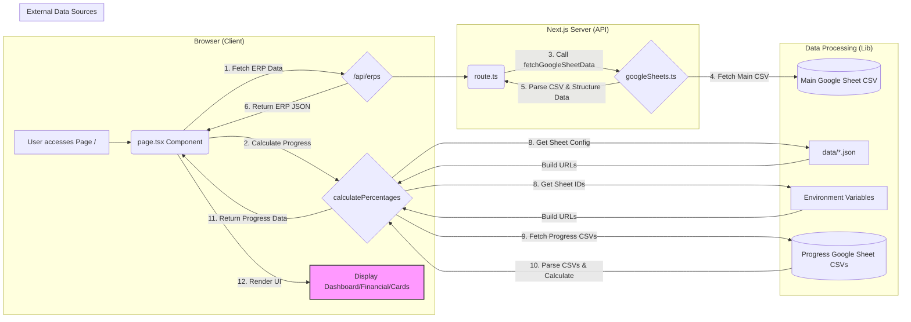

# Data Flowchart (Mermaid)

This diagram illustrates the data flow within the ERP/Outsourcing Dashboard application.

**Explanation:**

1.  **User Interaction:** The user accesses the main page (`page.tsx`).
2.  **Initial Data Fetch:**
    *   `page.tsx` makes an API call to `/api/erps` to get the main list of ERPs.
    *   `page.tsx` calls the `calculatePercentages` function to get progress data for different sections (Pipeline, Onboarded, Outsourcing).
3.  **API Route (`/api/erps`):**
    *   The API route (`route.ts`) receives the request.
    *   It calls `fetchGoogleSheetData` from `googleSheets.ts`.
4.  **Main Data Fetching (`googleSheets.ts`):**
    *   `fetchGoogleSheetData` constructs the URL for the main Google Sheet CSV using `MAIN_SHEET_ID` from environment variables.
    *   It fetches the CSV data from the Google Sheet.
    *   It parses the CSV and structures the data into the `ERP` format.
    *   The structured data is returned to the API route.
5.  **API Response:** The API route sends the structured ERP data back to the `page.tsx` component as JSON.
6.  **Progress Calculation (`calculatePercentages.ts`):**
    *   This function receives configurations (sheet names, base URLs) from `data/*.json` files.
    *   It gets specific Google Sheet IDs (`NEXT_PUBLIC_*_CSV_ID`) from environment variables.
    *   It constructs the full CSV URLs for the progress sheets.
    *   It fetches the CSV data for each required progress sheet.
    *   It parses the CSVs and calculates the percentage based on the specified mode ("normal" or "pipeline").
    *   The calculated progress data is returned to `page.tsx`.
7.  **UI Rendering:** `page.tsx` uses the fetched ERP data and the calculated progress data to render the appropriate UI components (`DashboardSection`, `FinancialDashboard`, `ERPCard`, etc.).
