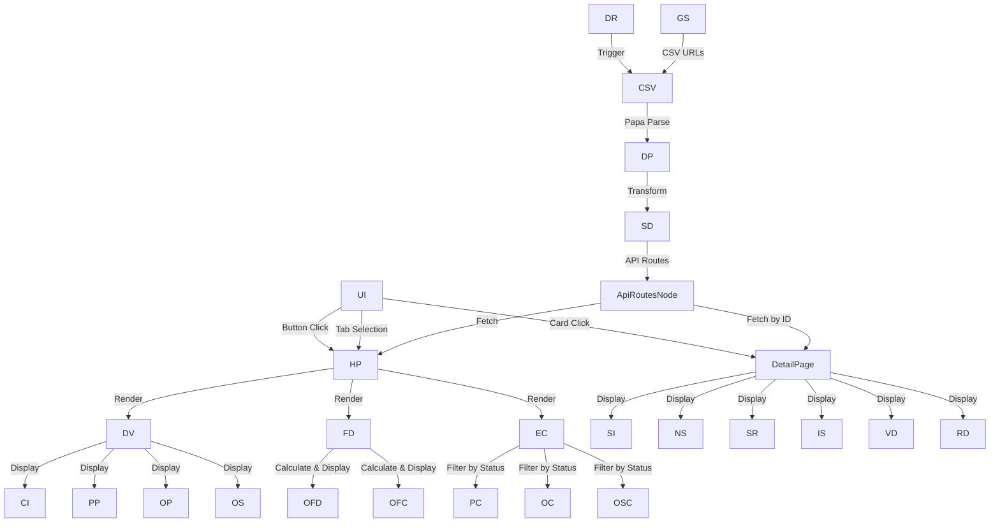

# ERP-MIS Dashboard Documentation

## Table of Contents
1. [Non-Technical Summary](#non-technical-summary)
2. [Introduction](#introduction)
3. [System Architecture](#system-architecture)
4. [Data Sources](#data-sources)
5. [Main Features](#main-features)
6. [Components](#components)
7. [Data Flow](#data-flow)
8. [Data Flow Diagram](#data-flow-diagram) 
9. [User Interface](#user-interface)
10. [Technical Implementation](#technical-implementation)
11. [Deployment and Configuration](#deployment-and-configuration)

## Non-Technical Summary

### What is the ERP-MIS Dashboard?

The ERP-MIS Dashboard is a web application that helps managers and stakeholders track the status of various Enterprise Resource Planning (ERP) systems and outsourcing contracts. Think of it as a central control panel that shows you everything you need to know about your ERP systems at a glance.

### How Does It Work?

1. **Data Source**: The application gets its data from Google Sheets. These spreadsheets contain information about ERPs, their status, financial details, and any critical issues.

2. **Main Views**:
   - **Dashboard View**: Shows progress bars for different ERPs and contracts, along with critical issues and upcoming meetings
   - **Financial View**: Shows charts with financial information like project costs and invoice values
   - **ERP Cards**: Shows individual cards for each ERP with key information
   - **Detailed View**: When you click on an ERP card, you see all details about that specific ERP

3. **Real-time Updates**: The dashboard automatically refreshes every 10 seconds to show the latest information.

### Key Features for Business Users

- **Progress Tracking**: See how far along each ERP implementation or contract is
- **Financial Monitoring**: Track project costs and invoice values
- **Issue Management**: View critical issues that need attention
- **Meeting Coordination**: See upcoming meetings related to ERPs
- **Document Access**: Quick links to important documents for each ERP

### How Each Part Works

- **Google Sheets Connection**: The app connects to your Google Sheets to get the latest data
- **Dashboard**: Shows visual progress bars and charts to help you understand status at a glance
- **ERP Cards**: Each card represents one ERP system or contract with its key information
- **Detailed Pages**: Clicking on a card shows you everything about that ERP, including contacts, status, and documents
- **Navigation**: Simple buttons let you switch between different views

## Introduction

The ERP-MIS Dashboard is a web application designed to track and monitor Enterprise Resource Planning (ERP) systems and outsourcing contracts. It provides a centralized dashboard for visualizing the status, progress, and financial aspects of various ERP implementations and outsourcing contracts.

The application serves as a management information system (MIS) that helps stakeholders track:
- ERPs in the pipeline (not yet implemented)
- Onboarded ERPs (already implemented)
- Outsourcing contracts
- Financial status of ERPs and contracts
- Critical issues and upcoming meetings

## System Architecture

The ERP-MIS Dashboard is built using the following technologies:

- **Frontend Framework**: Next.js 15.2.3 with React 19
- **Styling**: Tailwind CSS
- **Data Visualization**: Recharts for charts and graphs
- **Data Fetching**: SWR for client-side data fetching with caching
- **CSV Parsing**: Papa Parse for processing CSV data from Google Sheets
- **Database**: MongoDB (via Mongoose, though primarily using Google Sheets as data source)

The application follows a client-side rendering approach with Next.js's App Router architecture, using React Server Components and Client Components where appropriate.

## Data Sources

The primary data source for the application is Google Sheets. The application connects to several Google Sheets documents:

1. **Main Sheet**: Contains the core ERP data including names, statuses, contacts, and other metadata
2. **Pipeline Sheet**: Tracks the progress of ERPs in the pipeline
3. **Normal Sheet**: Tracks the progress of onboarded ERPs and outsourcing contracts
4. **Financial Sheet**: Contains financial data for ERPs and contracts
5. **Issues Sheet**: Tracks critical issues and upcoming meetings

The Google Sheets are accessed via published CSV URLs, which are configured in the environment variables:

```
MAIN_SHEET_ID="2PACX-1vSjjqex5XK88aFM9F2zHJsEMjIB4rLgzLwNSnAUjh7V2Q9Fw5HMedUkhjuJYYpUGga8E6Q_Bh1XAmi6"
NEXT_PUBLIC_PIPELINE_CSV_ID="2PACX-1vSZWhtDIlpGv3UOXkzQ9UYtYeFP_0mlWSE_7k9CG4VziId2QK1dBwDfRK1TPZojw0521GUYqGFSoLzz"
NEXT_PUBLIC_PIPELINE_LIVE_ID="11SB5QKIWeB97a9jbSu7FqpkGyIHMI5F7xNB2dtuyp9k"
NEXT_PUBLIC_NORMAL_CSV_ID="2PACX-1vS2E8YY6bKt4qj_bGVBw2A_e_Byc1-mXvMhy76gjEUFttF-cvZbLSNLBxyuwU9JTnbXoYO83eujkRDe"
NEXT_PUBLIC_NORMAL_LIVE_ID="1bskg7-Ly2MCLOaH0SPUMQh2DKGouHYAIlPEt4Zy1c-A"
NEXT_PUBLIC_FINANCIAL_CSV_ID="2PACX-1vRR_tREe_JS0tPVVYxy7rShHMjgmPOh_QQi-TqLHego5Wf3INdUVviFjR-VGswjmj4_NTNL1tjs71tV"
NEXT_PUBLIC_FINANCIAL_LIVE_ID="1Xjtn9k_gDbsnhKql9r0nv660M4bJZsXoJs7JibMKb0g"
NEXT_PUBLIC_ISSUES_CSV_ID="2PACX-1vSjjqex5XK88aFM9F2zHJsEMjIB4rLgzLwNSnAUjh7V2Q9Fw5HMedUkhjuJYYpUGga8E6Q_Bh1XAmi6"
```

## Main Features

### 1. Dashboard View
- Displays progress bars for pipeline, onboarded ERPs, and outsourcing contracts
- Shows critical issues and upcoming meetings
- Provides links to the source Google Sheets

### 2. Financial Dashboard
- Displays bar charts showing project costs and invoice values
- Separates data for onboarded ERPs and outsourcing contracts
- Shows totals in crores (1 crore = 10 million)

### 3. ERP Cards View
- Displays individual cards for each ERP or contract
- Filters ERPs by status (pipeline, onboarded, outsourcing)
- Shows key information like target dates, delay status, and contacts

### 4. Detailed ERP View
- Shows comprehensive information about a specific ERP or contract
- Displays current status, next steps, support required, and issues
- Provides links to related documents and resources
- Shows vendor/partner/contractor information

## Components

### Main Components

1. **Home Page (`src/app/page.tsx`)**
   - The main entry point of the application
   - Manages tab selection (dashboard, financial, ERP cards)
   - Fetches ERP data and progress percentages
   - Renders the appropriate view based on the selected tab

2. **ERP Detail Page (`src/app/erp/[id]/page.tsx`)**
   - Displays detailed information about a specific ERP
   - Fetches data for the selected ERP
   - Organizes information into sections (status, documents, etc.)

3. **Dashboard Section (`src/components/DashboardSection.tsx`)**
   - Displays the main dashboard view
   - Organizes content into a grid layout
   - Includes critical issues, pipeline, onboarded, and outsourcing sections

4. **Financial Dashboard (`src/components/FinancialDashboard.tsx`)**
   - Displays financial information using bar charts
   - Shows project costs and invoice values
   - Calculates and displays totals

5. **ERP Card (`src/components/ERPCard.tsx`)**
   - Displays a card for an individual ERP or contract
   - Shows key information like name, status, target dates
   - Handles display of extended dates and delay status

### Supporting Components

1. **Progress Bar (`src/components/ProgressBar.tsx`)**
   - Displays a progress bar with animation
   - Used to visualize completion percentages

2. **Pipeline Component (`src/components/PipelineComponent.tsx`)**
   - Displays a bar chart for pipeline ERPs
   - Uses Recharts for visualization

3. **Critical Issues & Meetings (`src/components/CriticalIssuesMeetings.tsx`)**
   - Displays critical issues and upcoming meetings
   - Fetches data using SWR for real-time updates

4. **Loading Components (`src/components/Loading.tsx` and `src/components/LoadingExp.tsx`)**
   - Display loading indicators while data is being fetched

5. **Footer (`src/components/Footer.tsx`)**
   - Displays the application footer

6. **Back to Home (`src/components/BackToHome.tsx`)**
   - Provides navigation back to the home page

## Data Flow

1. **Data Fetching**:
   - The application fetches data from Google Sheets using published CSV URLs
   - CSV data is parsed using Papa Parse
   - Data is transformed into structured objects for use in the application
   - SWR is used for client-side data fetching with caching and revalidation

2. **API Routes**:
   - `/api/erps`: Fetches all ERP data
   - `/api/erps/[id]`: Fetches data for a specific ERP

3. **Data Processing**:
   - `calculatePercentages.ts`: Calculates progress percentages for ERPs and contracts
   - `financialDashboardData.ts`: Processes financial data for the dashboard
   - `googleSheets.ts`: Fetches and transforms data from Google Sheets

4. **State Management**:
   - React's useState and useEffect hooks manage component state
   - SWR manages data fetching state and caching
   - localStorage is used to persist tab selection

5. **Data Refresh**:
   - Data is automatically refreshed every 10 seconds (configurable via `DATA_REFRESH_INTERVAL`)
   - SWR handles revalidation and caching

## Data Flow Diagram



### Detailed Data Flow Explanation

1. **Data Source to Application**:
   - Google Sheets documents are published as CSV URLs
   - The application fetches these CSVs using the fetch API
   - Papa Parse library converts CSV text into structured data
   - Data processing utilities transform this data into application-specific formats

2. **API Layer**:
   - API routes (`/api/erps` and `/api/erps/[id]`) serve as an abstraction layer
   - These routes fetch data from Google Sheets and return it in JSON format
   - Components use these API routes to get data rather than fetching directly from Google Sheets

3. **Component Data Flow**:
   - Home Page fetches all ERP data and progress percentages
   - Based on the selected tab, it renders the appropriate view
   - Each view (Dashboard, Financial, ERP Cards) processes and displays data differently
   - Detail Page fetches data for a specific ERP by ID

4. **User Interaction Flow**:
   - User selects tabs to switch between views
   - User clicks on ERP cards to view detailed information
   - User clicks on progress bars or charts to open source Google Sheets

5. **Data Refresh Flow**:
   - A timer triggers data refresh every 10 seconds
   - SWR handles caching and revalidation of data
   - Components re-render with fresh data when available

## User Interface

The application has a responsive user interface with three main views:

1. **Dashboard View**:
   - Grid layout with sections for critical issues, pipeline, onboarded, and outsourcing
   - Progress bars and charts visualize completion percentages
   - Links to source Google Sheets

2. **Financial Dashboard**:
   - Bar charts showing project costs and invoice values
   - Totals displayed in crores
   - Separate sections for onboarded ERPs and outsourcing contracts

3. **ERP Cards View**:
   - Grid of cards showing individual ERPs or contracts
   - Filterable by status (pipeline, onboarded, outsourcing)
   - Cards show key information and link to detailed views

4. **Detailed ERP View**:
   - Comprehensive information about a specific ERP or contract
   - Sections for status, next steps, support, issues, etc.
   - Links to related documents and resources
   - Flip cards for vendor/partner information

## Technical Implementation

### Data Types

The application uses TypeScript for type safety. Key types include:

1. **ERP**: Represents an ERP or contract with properties like name, status, contacts, etc.
2. **SheetPercentage**: Represents progress percentage for a sheet
3. **CsvSheet**: Represents a Google Sheet with CSV URL
4. **FinancialData**: Represents financial data for an ERP or contract

### Data Fetching and Processing

1. **Google Sheets Integration**:
   - The application fetches data from Google Sheets using published CSV URLs
   - CSV data is parsed using Papa Parse
   - Data is transformed into structured objects for use in the application

2. **Progress Calculation**:
   - For normal mode: Progress is read directly from cell P2 in the sheet
   - For pipeline mode: Progress is calculated as (completed stages / total stages) * 100

3. **Financial Data Processing**:
   - Financial data is extracted from specific columns in the CSV
   - Data is separated by type (onboarded or outsourcing)
   - Totals are calculated and formatted for display

### UI Components and Styling

1. **Tailwind CSS**:
   - The application uses Tailwind CSS for styling
   - Responsive design with mobile-first approach
   - Custom colors and animations

2. **Charts and Visualizations**:
   - Recharts is used for bar charts and other visualizations
   - Custom components for progress bars and other UI elements

3. **Interactive Elements**:
   - Flip cards for vendor/partner information
   - Clickable links to source Google Sheets
   - Tab navigation for different views

## Deployment and Configuration

### Environment Variables

The application requires the following environment variables:

```
NEXT_PUBLIC_API_URL="http://localhost:3000"
MAIN_SHEET_ID="your-sheet-id"
NEXT_PUBLIC_PIPELINE_CSV_ID="your-pipeline-csv-id"
NEXT_PUBLIC_PIPELINE_LIVE_ID="your-pipeline-live-id"
NEXT_PUBLIC_NORMAL_CSV_ID="your-normal-csv-id"
NEXT_PUBLIC_NORMAL_LIVE_ID="your-normal-live-id"
NEXT_PUBLIC_FINANCIAL_CSV_ID="your-financial-csv-id"
NEXT_PUBLIC_FINANCIAL_LIVE_ID="your-financial-live-id"
NEXT_PUBLIC_ISSUES_CSV_ID="your-issues-csv-id"
```

### Deployment

The application can be deployed using standard Next.js deployment methods:

1. Build the application: `npm run build`
2. Start the production server: `npm run start`

### Configuration

1. **Data Refresh Interval**:
   - Configure the data refresh interval in `src/lib/constants.ts`
   - Default is 10 seconds (10 * 1000 milliseconds)

2. **Google Sheets**:
   - Configure Google Sheet IDs in environment variables
   - Ensure sheets are published to the web with the correct permissions

3. **Sheet Structure**:
   - The application expects specific column structures in the Google Sheets
   - Refer to the data processing functions for expected column layouts
